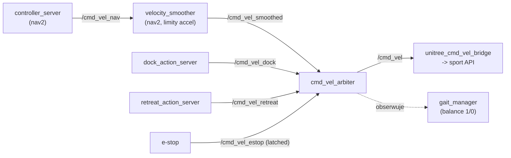

# Architecture & Engineering Guidelines — `g1_courier_ws`

Dokument projektowy. Czytaj **przed** dodaniem nowego node'a, akcji, sensora albo fazy misji. Każda decyzja architektoniczna ma być zgodna z tymi zasadami; jeżeli nie jest — najpierw zaktualizuj ten plik, potem kod.

**Stack referencyjny: ROS2 Humble.** Wszystkie reguły w tym dokumencie są weryfikowane pod kątem zgodności z oficjalną dokumentacją:
- Concepts: <https://docs.ros.org/en/humble/Concepts.html>
- Tutorials: <https://docs.ros.org/en/humble/Tutorials.html>
- Design articles: <https://design.ros2.org>

ROS1 (`wiki.ros.org`) ma inne wzorce (`actionlib`, `roslaunch` XML, `catkin`, `nodelets`, `dynamic_reconfigure`) — **nie używamy ich**. Lista różnic w [Appendix B](#appendix-b-ros1-vs-ros2-czego-nie-używamy).

Spis treści:
1. [Cele i zasady projektu](#1-cele-i-zasady-projektu)
2. [Warstwy architektury](#2-warstwy-architektury)
3. [Mechanizmy komunikacji ROS2 — kiedy czego używać](#3-mechanizmy-komunikacji-ros2--kiedy-czego-używać)
4. [QoS profile — tabela decyzyjna](#4-qos-profile--tabela-decyzyjna)
5. [Executors i CallbackGroups](#5-executors-i-callbackgroups)
6. [Konwencje nazewnictwa](#6-konwencje-nazewnictwa)
7. [Konfiguracja i parametry](#7-konfiguracja-i-parametry)
8. [Konwencje TF](#8-konwencje-tf)
9. [Lifecycle nodes i composition (forward-looking)](#9-lifecycle-nodes-i-composition-forward-looking)
10. [Jak dodać nowy skill (przykład krok-po-kroku)](#10-jak-dodać-nowy-skill)
11. [Jak dodać nowy sensor](#11-jak-dodać-nowy-sensor)
12. [Jak dodać nową fazę misji](#12-jak-dodać-nową-fazę-misji)
13. [Koordynacja loco↔manipulacja](#13-koordynacja-locomanipulacja)
14. [Obsługa błędów, retries, recovery](#14-obsługa-błędów-retries-recovery)
15. [Zarządzanie stanem — gdzie żyje co](#15-zarządzanie-stanem--gdzie-żyje-co)
16. [Logging, telemetria, obserwowalność](#16-logging-telemetria-obserwowalność)
17. [Testowanie](#17-testowanie)
18. [Bezpieczeństwo i safety net](#18-bezpieczeństwo-i-safety-net)
19. [Code review / pull request checklist](#19-code-review--pull-request-checklist)
- [Appendix A: anti-patterns z których uciekamy](#appendix-a-anti-patterns-z-których-uciekamy)
- [Appendix B: ROS1 vs ROS2 — czego nie używamy](#appendix-b-ros1-vs-ros2-czego-nie-używamy)
- [Appendix C: mapowanie reguł na oficjalną dokumentację](#appendix-c-mapowanie-reguł-na-oficjalną-dokumentację)

---

## 1. Cele i zasady projektu

**Cel produktu**: G1 podchodzi do biurka A, lokalizuje karton po AprilTagu, podnosi, niesie do biurka B, odkłada, wraca. Cykl powtarzalny w obie strony, działa godzinami bez ingerencji operatora.

**Pięć zasad architektury**, w kolejności priorytetu:

1. **Layered architecture, strict directionality.** Mission → Skills → Platform → Drivers. Wyższa warstwa woła niższą; niższa nigdy nie woła wyższej. Jak skill chce wpłynąć na misję — zwraca to przez Result/Feedback, nie przez topic do mission node.

2. **Każdy interfejs między warstwami jest zadeklarowany w `g1_courier_msgs`.** Jeżeli dwa node'y mają gadać między sobą czymś nietrywialnym — definicja idzie do paczki msgs. Nie ma "ad-hoc topiku z `std_msgs/String` JSON-em w środku". To była jedna z chorób starego kodu.

3. **Stan długi żyje w jednym miejscu.** Misja ma blackboard (BT). Konfiguracja runtime żyje w parametrach ROS. Stan platformy (pozycje stawów, IMU) żyje w `lowstate`. Nie duplikujemy. Jeden source of truth na fakt.

4. **Reaktywność na poziomie skill, nie misji.** P-controllery, pętle wizyjne, tracking — żyją wewnątrz skilla i nie wyciekają na zewnątrz. Misja widzi tylko: "pick rozpoczęty / w 60% / sukces / porażka". Nigdy nie miksuj BT z reaktywnym sterowaniem.

5. **Każda akcja musi być przerywalna, każde wejście musi mieć timeout, każda rzecz która może rąbnąć ma e-stop.** Jak coś wisi 30 minut bo czekało na heartbeat którego nie było — to bug w architekturze, nie w infrastrukturze.

---

## 2. Warstwy architektury

```
┌─ Mission layer ─────────────────────────────────────────────────────┐
│   g1_courier_mission/mission_node.py (BT)                           │
│   - decyzje o sekwencji, retries, recovery                          │
│   - nie wie nic o low-level kontroli, czyta jedynie wyniki actions  │
└─────────────────────────────────────────────────────────────────────┘
              ↓  actions z g1_courier_msgs
┌─ Skills layer ──────────────────────────────────────────────────────┐
│   g1_courier_arm_skills, g1_courier_docking, g1_courier_mission/... │
│   - jeden skill = jeden ActionServer                                │
│   - wewnętrznie reaktywny (P-loop, visual servo, interpolacja)      │
│   - zewnętrznie: Goal/Feedback/Result, cancel obsłużone             │
└─────────────────────────────────────────────────────────────────────┘
              ↓  /cmd_vel_*, /arm_sdk, parametry
┌─ Platform layer ────────────────────────────────────────────────────┐
│   nav2 stack, slam_toolbox/AMCL, cmd_vel_arbiter,                   │
│   pointcloud_to_laserscan, apriltag_ros                             │
│   - generyczne, niczemu konkretnemu nie podporządkowane             │
│   - wymienialne (np. AMCL → cartographer) bez ruszania skills       │
└─────────────────────────────────────────────────────────────────────┘
              ↓  /lowstate, /odom, /tf, /scan
┌─ Drivers / hardware ────────────────────────────────────────────────┐
│   unitree_ros2 (sport API + arm_sdk)                                │
│   livox_ros_driver2, realsense2_camera                              │
│   - cienkie owijki nad SDK producenta, nic poza tym                 │
└─────────────────────────────────────────────────────────────────────┘
```

**Reguły wertykalne:**
- Skill nie woła innego skilla. Jak `place_box` "potrzebuje" docka — to mission BT je sklei.
- Mission nie publikuje na low-level topiki (`/arm_sdk`, `/cmd_vel_dock`). Tylko `actions/services` paczki `g1_courier_msgs`.
- Driver layer nie zna ROS-a poza minimalnym subskrypcją/publishingiem. Logika w skillach.

### Łańcuch `cmd_vel` — kto publikuje, kto czyta

Jedyna droga komend prędkości do robota. **Każdy nowy producent ruchu wchodzi przez
arbitra, nigdy wprost na `/cmd_vel`.**



Arbiter: priorytet **dock > retreat > nav**, e-stop nadrzędny nad wszystkim, capy
per-tryb (`normal` / `carry`) i podłoga prędkości (firmware odmawia kroku poniżej
progu). **Kolejność jest istotna:** wygładzanie musi być *przed* capami — odwrotna
dawałaby gładki sygnał, a potem schodek od capa.

⚠️ **Pułapka, która nas kosztowała czas:** nav2 remapuje `/cmd_vel → /cmd_vel_nav` dla
**całej** grupy, więc `velocity_smoother` też *czyta* `/cmd_vel_nav`. Jeśli arbiter
czyta to samo, smoother publikuje **w próżnię** i skonfigurowane limity przyspieszenia
nie działają — bez żadnego błędu w logach. Sprawdzenie:
`ros2 topic info /cmd_vel_smoothed` musi pokazać `Subscription count >= 1`.
Wybór źródła: param `nav_topic` arbitra (arg `arbiter_nav_topic`).

---

## 3. Mechanizmy komunikacji ROS2 — kiedy czego używać

Bazujemy na oficjalnych definicjach z `docs.ros.org/en/humble/Concepts/Basic.html`:

> **Topics** implement a strongly-typed, anonymous publish/subscribe mechanism for asynchronous message passing.
> **Services** enable synchronous request-response communication.
> **Actions** support long-running tasks with feedback during execution... suitable for operations requiring progress updates (preemption, cancellation) rather than simple request-response patterns.
> **Parameters** are configuration values nodes can access and modify at runtime.

Nasze reguły rozszerzają te definicje o praktyczne progi (czas, częstotliwość, semantykę) — nie są z nimi sprzeczne.

### Topic
**Używaj gdy**: strumień danych, stan ciągły, dane są tanie, brak potrzeby potwierdzenia.
- przykłady w projekcie: `/cmd_vel_*`, `/scan`, `/detections`, `/lowstate`.
- QoS: `BEST_EFFORT` dla sensorów wysokiej częstotliwości, `RELIABLE` dla komend (cmd_vel) i danych konfigowych (latched).
- **Zła motywacja dla topiku**: "muszę odpalić jakąś jednorazową rzecz" → użyj service. "Muszę poczekać na koniec" → użyj action.

### Service
**Używaj gdy**: jednorazowe, szybkie (<100 ms), zwraca wynik, **nie** ma długiej egzekucji.
- przykłady: `/safety/set_carry_mode`, `/safety/set_freeze`, `set_parameters`.
- Zasady:
  - Nie blokuj klienta dłużej niż 200 ms.
  - Nie wywołuj długich operacji w handlerze (publikowanie ciężkich rzeczy, IO).
  - Nigdy nie używaj service do "zacznij robić X" gdzie X trwa dłużej niż chwila → to jest action.

### Action
**Używaj gdy**: długa operacja (>1 s), klient chce feedback, klient chce móc anulować, możesz raportować postęp.
- przykłady: `/pick_box`, `/place_box`, `/dock_to_table`, `/courier/navigate_to_pose`, `/retreat`.
- Zasady:
  - **Każdy nasz skill jest action**. Bez wyjątków.
  - Goal Response → przyjmij/odrzuć od razu (np. busy lock).
  - Feedback co najmniej raz na fazę. Bez feedbacku misja nie wie kiedy ratować.
  - Result musi mieć `success: bool` i `message: string` — to nasz minimalny kontrakt.
  - Cancel **musi** doprowadzić system do bezpiecznego stanu (`stop()` controllera, `weight=0` na arm_sdk, twist=0).

### Parameter
**Używaj gdy**: wartość konfiguracyjna, rzadko zmieniana w runtime, ustawiana per-uruchomienie.
- przykłady: `kp_xy`, `max_vx_carry`, `arm_sdk_topic`.
- Zasady:
  - Wszystkie parametry **deklarowane** w `__init__` z jawnym default.
  - **Nie** twórz "magic strings" parametrów z `set_parameters_atomically` jako sposobu komunikacji między node'ami. To anti-pattern.
  - Plik YAML w `config/` paczki, wczytywany przez launch.

### TF
**Używaj gdy**: relacja przestrzenna (frame A → frame B). Pozycje w przestrzeni 3D.
- Nigdy nie publikuj pozycji bezpośrednio w topiku gdy istnieje sensowny układ współrzędnych TF.
- Dla AprilTagów: każdy tag ma swój frame (`tag_a`, `tag_b`); TF lookup zamiast subskrypcji do detekcji.

### Tabela decyzyjna

| Scenariusz                                          | Mechanizm |
|-----------------------------------------------------|-----------|
| 50 Hz strumień prędkości                            | Topic     |
| "Włącz carry mode"                                  | Service   |
| "Podejdź do biurka A"                               | Action    |
| "Jaka jest pozycja kamery względem base_link"       | TF        |
| "Maksymalna prędkość vx z paczką"                   | Parameter |
| "Status misji do dashboardu, raz na sekundę"        | Topic (latched lub timer)  |
| "Awaryjny stop"                                     | Topic (`/cmd_vel_estop` Bool, latched) |

---

## 4. QoS profile — tabela decyzyjna

Źródło: `docs.ros.org/en/humble/Concepts/Intermediate/About-Quality-of-Service-Settings.html`. ROS2 definiuje cztery standardowe profile QoS — używamy ich **jako preset**, nie wymyślamy własnych chyba, że jest istotny powód.

| Profil               | Reliability | Durability | History     | Depth | Kiedy używamy w projekcie                                  |
|----------------------|-------------|------------|-------------|-------|------------------------------------------------------------|
| `default`            | RELIABLE    | VOLATILE   | KEEP_LAST   | 10    | `/cmd_vel`, command Twisty, większość naszych topików      |
| `sensor_data`        | BEST_EFFORT | VOLATILE   | KEEP_LAST   | 5     | `/scan`, `/livox/lidar`, `/camera/image_raw`, `/lowstate`  |
| `services_default`   | RELIABLE    | VOLATILE   | KEEP_LAST   | 10    | Wszystkie `*.srv` (domyślny RMW dla services)              |
| `parameters`         | RELIABLE    | VOLATILE   | KEEP_LAST   | 1000  | Komunikacja z parameter serwerem (RMW domyślne)            |

**Reguły praktyczne:**
- **Sensor wysokiej częstotliwości** (LiDAR, kamera, lowstate ~500 Hz) → `sensor_data`. Świeżość > kompletność. Jeden brakujący frame nie boli, opóźniony — boli.
- **Strumień komend** (`/cmd_vel*`) → `default` (RELIABLE). Komenda nie może zniknąć po drodze.
- **Latched** (np. statyczne układy współrzędnych TF, `/map`, `/cmd_vel_estop`) → DURABILITY = `TRANSIENT_LOCAL`. Nowo dołączający subskrybent dostaje ostatnią wiadomość.
- **Action server**: nie tuninguj QoS samej akcji (rclpy domyślne są właściwe). Tuninguj QoS topiku feedback jeśli go publikujesz osobno (rzadko).

W kodzie:
```python
from rclpy.qos import QoSProfile, ReliabilityPolicy, HistoryPolicy
sensor_qos = QoSProfile(
    depth=5, reliability=ReliabilityPolicy.BEST_EFFORT, history=HistoryPolicy.KEEP_LAST,
)
self.create_subscription(LaserScan, '/scan', cb, sensor_qos)
```
Albo jeszcze lepiej, gotowe presety:
```python
from rclpy.qos import qos_profile_sensor_data
self.create_subscription(LaserScan, '/scan', cb, qos_profile_sensor_data)
```

**Anti-pattern**: subskrybować LiDAR z domyślnym `default` (RELIABLE, KEEP_LAST 10) — kolejka rośnie, latencja gwałtownie skacze, system gubi rytm.

---

## 5. Executors i CallbackGroups

Źródło: `docs.ros.org/en/humble/Concepts/Intermediate/About-Executors.html`. Nasze action servery używają `MultiThreadedExecutor` (`pick_action_server.py`, `place_action_server.py`, `dock_action_server.py`) — to nie przypadek.

### Trzy typy executora

| Executor                       | Kiedy                                                                 |
|--------------------------------|-----------------------------------------------------------------------|
| `SingleThreadedExecutor`       | Domyślny, prosty. Wszystkie callbacki sekwencyjnie. Dla większości platform layer.   |
| `MultiThreadedExecutor`        | **Action servery**, węzły z wieloma równoczesnymi callbackami (subskrypcja + service + timer). |
| `StaticSingleThreadedExecutor` | Optymalizacja dla node'ów które nie tworzą callbacków w runtime.       |

### Reguły dla naszego stosu

- **Każdy action server uruchamiamy z `MultiThreadedExecutor`**. Powód: w trakcie wykonywania `execute_callback` (długiego) muszą działać subskrypcje (`/lowstate`, `/scan`, `/detections`). Z `SingleThreadedExecutor` byłby deadlock — execute trzyma wątek, callbacki sensorów stoją.
  
  ```python
  executor = MultiThreadedExecutor()
  executor.add_node(node)
  executor.spin()
  ```

- **CallbackGroup**: w naszym kodzie (`pick_action_server.py`) używamy `MutuallyExclusive` (domyślny). To bezpieczne — sensory i akcja się nie blokują (różne grupy), ale dwa goale tej samej akcji nie wykonają się jednocześnie (jedna grupa). Dla bardziej złożonych przypadków:

  | Sytuacja                                                | Grupa                              |
  |---------------------------------------------------------|------------------------------------|
  | Sensorowe subskrypcje w action serverze                 | Default (per-callback `MutuallyExclusive`) |
  | Action `execute_callback` + sensorowy callback          | Każdy w osobnej grupie (równoległe) |
  | Wewnątrz jednego skill action: wiele równoczesnych call | `Reentrant`, ze zmiennymi pod lock |
  | Service handler który wewnętrznie woła inną action      | Każde w osobnej grupie (uniknięcie deadlocka) |

- **Anti-pattern**: jeden globalny executor dla całego procesu z kilkoma node'ami w `MutuallyExclusive` — przy długim execute_callback wszystko stoi.

### Threading w skillu (controller layer)

`ArmController`, `AprilTagAligner` itd. — to **pure Python, bez ROS-a**. Nie tworzą wątków. Wątek pochodzi z executora i z busy-locka w action serverze. Reguła: jeśli musisz `time.sleep()` w środku execute, sleep krótko (≤100 ms) i sprawdzaj `stop_event` między iteracjami. Nigdy `threading.Thread` w skillu controller — wszystko idzie przez executor.

---

## 6. Konwencje nazewnictwa

### Formalne reguły dopuszczalnych znaków

Źródło: `design.ros2.org/articles/topic_and_service_names.html`. **Te reguły są twarde**, naruszenie = node odmówi startu:

- Dozwolone znaki: `[0-9 a-z A-Z _ /]`, opcjonalnie `~` na początku (private namespace).
- **Nie zaczynaj od cyfry**.
- **Nie kończ slashem**.
- **Nie używaj podwójnego slasha ani podwójnego underscore**.
- Tilde od reszty oddzielony slashem: `~/foo` (poprawne), `~foo` (błąd).
- Token zaczynający się od `_` to **hidden topic** — narzędzia (`ros2 topic list`) go nie pokażą bez `--include-hidden-topics`. Nigdy nie nazywaj produkcyjnego topiku `_<coś>` przez przypadek.

### Topiki
- Niska litera, snake_case: `/cmd_vel_dock`, `/light_tracking/detection_json`.
- Topiki globalne (bez przestrzeni nazw węzła): `/cmd_vel`, `/scan`, `/odom`.
- Wewnętrzne strumienie node'a: prefix node'a, `/dock/state` (rzadko, raczej service lub feedback action).
- Sensorowe topiki driverów: pozostaw nazwę z paczki driverów (`/livox/lidar`, `/camera/color/image_raw`).

### Akcje
- Nazwa = czasownik w trybie rozkazującym: `/pick_box`, `/dock_to_table`, `/retreat`.
- Globalne, bez prefixu paczki — to jest publiczne API misji.
- **Wyjątek — proxy nad upstreamem**: jeśli akcja owija akcję z paczki zewnętrznej i ich nazwy by kolidowały (np. nasza `NavigateToPose` vs `nav2_msgs/NavigateToPose`), proxy idzie pod namespace `/courier/`. Stąd `/courier/navigate_to_pose` opakowuje `/navigate_to_pose` z nav2. Reguła: namespace tylko gdy konflikt jest realny, nie profilaktycznie.

### Serwisy
- Nazwa = setter/getter: `/safety/set_carry_mode`, `/safety/set_freeze`.
- Prefix kategorii (`/safety`, `/diagnostics`) gdy jest sens grupowania.

### Node'y
- Plik = `<purpose>_node.py` lub `<purpose>_action_server.py`.
- Nazwa node'a = identyczna z plikiem (bez `.py`): `cmd_vel_arbiter`, `pick_action_server`.

### Układy współrzędnych TF (kanoniczne)
```
map → odom → base_footprint → base_link → camera_link  (RealSense)
              (REP-120,        (= pelvis)  → livox_frame (montaz per-robot)
               plasko na                   → imu_link
               podlodze)                   → laser_link  (rzutowany 2D scan)
            tag_a, tag_b                   (AprilTagi, frame per tag)
```
`base_footprint` jest **bazą 2D dla nav2** (AMCL, costmapy, bt_navigator,
behavior_server, collision_monitor) — patrz §8.

### Parametry
- snake_case, hierarchia kropką: `apriltag.kp_xy`, `lidar.target_distance_m`.
- Jednostki w nazwie: `_m`, `_s`, `_rad`, `_hz`. Brak jednostki = bug review.

### Stałe / pliki konfiguracyjne
- `config/<scope>.yaml`. Jeden plik per node lub per logiczna jednostka.
- Komentarze YAML obowiązkowe dla każdego parametru który się tuninguje (`# TODO_TUNE: ...`).

---

## 7. Konfiguracja i parametry

**Hierarchia ładowania:**
1. Defaulty w kodzie (`declare_parameter('foo', default_value)`).
2. YAML z paczki (`share/<pkg>/config/<scope>.yaml`).
3. Override z linii poleceń (`-p foo:=42`).
4. Override z launch (`parameters=[{...}]`).

**Reguły:**
- **Każdy parametr ma default**. Brak defaulta → exception przy starcie node'a, nie później.
- **Każdy YAML ma minimum jeden komentarz na sekcję**. Czytelność.
- Parametry dynamiczne (zmiana w runtime) — tylko gdy jawnie zaprojektowane. Większość naszych parametrów jest static-after-init.
- **Nie używaj parametrów do trzymania stanu**. Stan idzie do blackboard / pamięci node'a.

---

## 8. Konwencje TF

- `map` jest globalna, statyczna w czasie misji. Producent: AMCL.
- `odom` jest "pamięcią mięśniową" — driftuje, ale spójna w krótkim czasie. Producent: unitree odometry przez `odom_tf_relay`.
- **`base_footprint` jest bazą 2D dla nav2** (REP-120): leży **płasko na podłodze**,
  ma tylko `x, y, yaw`. Wszystkie ramki bazowe nav2 wskazują na nią —
  `amcl.base_frame_id`, `bt_navigator.robot_base_frame`, oba costmapy,
  `behavior_server`, `collision_monitor`, `target_frame` w `pointcloud_to_laserscan`.
- `base_link` jest punktem referencyjnym robota. Pozycja: środek między biodrami, na poziomie talii.
  Producent: **statyczny** spaw `base_footprint → base_link` o wysokość miednicy.

**Dlaczego dwie ramki, a nie jedna:** firmware G1 podaje w odometrii pozę **miednicy**
(z ≈ 0.75 m, wraz z przechyłami tułowia). Gdyby baza 2D nav2 leżała na miednicy, AMCL
kleiłby płaszczyznę mapy do bioder, a przechył tułowia przesuwałby skan względem mapy.
`odom_tf_relay` z `flatten:=true` rzutuje pozę na podłogę (zeruje `z`, `roll`, `pitch`).
Efekt uboczny, bardzo pożądany: `min_height`/`max_height` w `pointcloud_to_laserscan`
stają się **metrami nad podłogą**, a nie wysokością w ramce lidaru zamontowanego do góry
nogami — czyli wartościami przenośnymi między robotami.

**Odometria nie jest przezroczystym przekaźnikiem.** `odom_tf_relay` robi trzy rzeczy,
z których każda jest per-platforma i domyślnie wyłączona: dławik częstotliwości
(`max_rate`), korekta skali translacji (`trans_scale` — firmware potrafi grubo
niedoszacowywać dystans) i ZUPT (`still_dist` — firmware **całkuje kinematykę nóg
także na postoju**). Szczegóły i pomiary: `docs/etap_a_utwardzenie_nav.md`.

⚠️ **`trans_scale` jest stałą CHODU, nie robota.** Zmiana czegokolwiek w torze `cmd_vel`
(wygładzanie, capy, progi prędkości) zmienia sposób chodzenia, a przez to skalę błędu
odometrii — i unieważnia kalibrację. Zmierzone: 1.89 przy komendach schodkowych → 1.10
po wpięciu `velocity_smoothera`; pozostawienie starej wartości dawało +72% nadmiaru
drogi w TF i widocznie uciekający skan. **Odometria jest sprzężona z torem sterowania**
— traktuj te dwie rzeczy jako jedną jednostkę kalibracyjną, nie dwie niezależne.
- **Każdy sensor ma własny frame** zdefiniowany w URDF.
- **Nigdy nie hardkoduj transformacji** między frame'ami w kodzie. Zawsze przez `tf2_ros.Buffer.lookup_transform`.
- AprilTag detector publikuje tag frame'y dynamicznie. Skill, który czyta pose tagu, **lookupuje tag frame**, nie czyta z topika detekcji bezpośrednio (chyba że potrzebuje meta-danych jak ID, hamming).
- Lookup z timeoutem, zawsze: `buffer.lookup_transform(target, source, time, timeout=Duration(seconds=0.2))`.

---

## 9. Lifecycle nodes i composition (forward-looking)

**Status w v0.1**: nie używamy. **Plan na v0.2+**: używać dla platform layer.

### Lifecycle nodes (`rclpy.lifecycle.Node`)

Źródło: `docs.ros.org/en/humble/Tutorials/Intermediate/Managed-Nodes.html`. Lifecycle node ma jawne stany: `unconfigured → inactive → active → finalized` oraz reguły przejść (`configure`, `activate`, `deactivate`, `cleanup`, `shutdown`). Każde przejście jest serwisem.

**Kandydaci do migracji w v0.2:**
- Drivery sensorów (kamera, LiDAR) — operator może `deactivate` żeby chwilowo odciążyć system.
- AMCL i map_server — można re-localize bez restartu całego stacka.
- Action servery — możliwość "deaktywacji" zamiast zabijania procesu.

**Czego NIE robimy lifecycle:**
- Mission node (BT) — sam zarządza stanem przez blackboard, lifecycle byłby nadmiarowy.
- `cmd_vel_arbiter` — zawsze musi działać, bo zarządza safety.

### Composition (composable nodes)

Źródło: `docs.ros.org/en/humble/Tutorials/Intermediate/Composition.html`. Pozwala uruchomić wiele node'ów w jednym procesie z **zero-copy IPC** zamiast DDS. Kluczowe dla pipeline'ów wysokiej częstotliwości.

**Kandydaci v0.2:**
- `pointcloud_to_laserscan` + `slam_toolbox` lub `amcl` w jednym procesie — eliminuje serializację 3D pointcloudu.
- Pipeline kamery: `realsense2_camera_node` + `apriltag_node` w jednym procesie.

**Reguła**: jeśli A publikuje strumień, a B jest jedynym konsumentem i pracuje wysokowydajnie — kandydaci do composition. Jeżeli B/C/D słuchają tego samego topiku z różnych procesów — composition nic nie da, DDS wystarczy.

---

## 10. Jak dodać nowy skill

Przykład: dodajemy skill `OpenDoor` (otwarcie drzwi po wykryciu klamki).

### Krok 1: Zdefiniuj kontrakt w `g1_courier_msgs`

`action/OpenDoor.action`:
```
# Goal
geometry_msgs/PoseStamped handle_pose
float32 push_distance_m
float32 timeout_s
---
# Result
bool success
string message
bool door_opened
---
# Feedback
string phase   # "approach" / "grasp_handle" / "rotate" / "push" / "release"
float32 progress
```

Dodaj do `CMakeLists.txt` w `set(action_files ...)`. Build:
```bash
colcon build --packages-select g1_courier_msgs
```

### Krok 2: Stwórz paczkę `g1_courier_door_skill` (lub dodaj do istniejącej, jeśli logicznie pasuje)

Kopiuj layout z `g1_courier_arm_skills`:
- `package.xml`, `setup.py`, `setup.cfg`, `resource/<pkg>`,
- `<pkg>/__init__.py`,
- `<pkg>/door_controller.py` — czysta logika sterowania (bez ROS, testowalna unit-testami),
- `<pkg>/open_door_action_server.py` — owijka ROS, ActionServer.

### Krok 3: Skill controller (logika)

```python
class DoorController:
    def run(self, handle_pose, push_m, on_phase, stop_event):
        # czysta logika: planowanie, interpolacja, weryfikacja
        ...
```

**Reguły:**
- Konstruktor przyjmuje *zależności* (publishery, gettery, log_fn) — żadnych globalnych.
- Brak `import rclpy` w pliku controllera.
- `stop_event: threading.Event` jako kontrakt anulowania.
- `on_phase: Callable[[str, float], None]` jako kontrakt feedbacku.

### Krok 4: Action server (ROS glue)

Wzór: `pick_action_server.py`. Co MUSI mieć:
- `goal_callback` z busy-lockiem (REJECT gdy zajęty).
- `cancel_callback` który woła `controller.stop()`.
- `execute_callback` który łapie wyjątki, zawsze ustawia `goal_handle.succeed/abort/canceled` i zawsze zwalnia busy-lock w `finally`.
- Parametry zadeklarowane jawnie, YAML w `config/`.

### Krok 5: Wpięcie w mission BT

W `g1_courier_mission/behaviors.py` dodaj klasę `OpenDoor(_ActionBehaviour)` analogicznie do `Pick`/`Place`. W mission tree dodaj nową fazę.

### Krok 6: Launch

Dorzuć `Node(...)` do `courier_full.launch.py`.

### Krok 7: Test

- Unit test dla `DoorController` (mock publisher, sprawdź sekwencję wiadomości).
- Smoke test action servera: `ros2 action send_goal /open_door ...`.
- Integration test w sim przed real robotem.

---

## 11. Jak dodać nowy sensor

Przykład: dodajemy drugą kamerę (np. nadgarstkowa).

### Krok 1: URDF
- Dodaj link i joint w opisie robota. Po tym TF chain musi być spójny: `base_link → ... → wrist_camera_link`.

### Krok 2: Driver
- Odpal driver z odpowiednim namespace (`/wrist_camera/...`) żeby nie kolidował z istniejącą kamerą.
- Statyczny TF publisher gdy URDF nie pokrywa wszystkich frame'ów (rzadko, wolimy URDF).

### Krok 3: Subskrypcja w skillu

- **Nigdy** nie subskrybuj surowych obrazów w mission node. Tylko skill który tego potrzebuje (np. `OpenDoor` z nadgarstka).
- QoS: `BEST_EFFORT, KEEP_LAST(1)` dla obrazów. `KEEP_ALL` to zła droga.

### Krok 4: Konfiguracja

- Ekspozycja, FPS, white balance — przez parametry, nie hardkoduj.
- Dorzuć do `bringup/config/<sensor>.yaml`.

### Krok 5: TF / kalibracja

- Kalibracja zawsze daje wynik jako transform `base_link → sensor_link`. Wpadnie do URDF, nie do kodu.
- Re-kalibracja powinna wymagać tylko podmiany URDF, **bez touchowania logiki**.

---

## 12. Jak dodać nową fazę misji

Przykład: po picku weryfikujemy karton kamerą nadgarstkową.

### Krok 1: Zdefiniuj sukces

Co znaczy "verify"? `bool` od skilla, czy pełna pose? Czy retry? Sukces jest **funkcją celu misji**, nie filozofii.

### Krok 2: Wybierz miejsce w drzewie BT

Czy to nowy phase (sequence), czy fallback? W `mission_node.py` w funkcji `_phase_pickup` dodaj kolejny child:

```python
seq.add_children([
    SetCarry('carry_off_for_pick', node, carrying=False),
    NavigateTo(...),
    DockTo(...),
    Pick(...),
    VerifyPickWithWristCamera(...),   # nowy node
    SetCarry('carry_on_after_pick', node, carrying=True),
])
```

### Krok 3: Zdecyduj o retry policy

- Czysta sekwencja: porażka jednego dziecka = porażka rodzica = abort cyklu.
- Z retry: opakuj w `py_trees.decorators.Retry`:
  ```python
  retry_pick = py_trees.decorators.Retry(name='retry_pick', child=Pick(...), num_failures=2)
  ```
- Z fallbackiem: `Selector` — próbujemy A, jak nie wyszło to B.

### Krok 4: Update blackboard

Jak nowa faza generuje fakt potrzebny później (np. zweryfikowana pose kartonu) — wstaw do blackboard. **Reguła**: w blackboardzie tylko fakty *misji*, nie tymczasowe `stuff`. Czysty blackboard po każdym cyklu.

---

## 13. Koordynacja loco↔manipulacja

Jeden z najczęstszych źródeł bugów u humanoidów. Reguły:

### Freeze przed manipulacją

Przed `pick_box`/`place_box` mission node woła:
```python
SetFreezeMode('freeze_for_arms', node, freeze=True)
```
`cmd_vel_arbiter` zaczyna publikować zera niezależnie od upstreamu. Po skończonej manipulacji mission zdejmuje freeze.

**Dlaczego service a nie topic?** Bo to dokładnie jednorazowa zmiana stanu z ACK. Topic `Bool` byłby pułapką: "kto ostatni publikował" w wielu edge case'ach.

### Carry mode po picku

Po `Pick` (przed marszem do drugiego stołu) mission woła:
```python
SetCarry('carry_on_after_pick', node, carrying=True)
```
Arbiter zaczyna clampować limity prędkości do `max_vx_carry` zamiast `max_vx_normal`.

### Weight ramping przy oddawaniu ramion

W `place_box` ostatni stage ma `weight_end=0.0` — `arm_sdk_weight` ramuje liniowo do zera, kontrola wraca do FSM bez szarpnięcia.

### E-stop

Topic `/cmd_vel_estop` (Bool, latched). Każdy node który widzi `True` musi przejść w bezpieczny stan (zera, weight=0). Nie ma "ignoruję bo ja wiem lepiej".

---

## 14. Obsługa błędów, retries, recovery

### Trzy poziomy błędu

| Poziom         | Kto reaguje              | Przykład                                     |
|----------------|--------------------------|----------------------------------------------|
| Tranzytowy     | Skill                    | Zgubił tag na chwilę → publikuj zero, czekaj |
| Skill failure  | Misja (retry policy)     | Pick nie zweryfikował chwytu                 |
| Misja failure  | Operator + bezpieczna pozycja | LiDAR padł w połowie cyklu              |

### Reguły dla skilla

- **Każda akcja ma timeout**. `request.timeout_s` jest *kontraktem misji* — skill go honoruje.
- Failure → `goal_handle.abort()`, `result.success=False`, `result.message=` opis. Misja decyduje co dalej.
- Skill **nie próbuje się sam ratować** w sposób który zmienia jego semantykę. "Pick" ma podnieść karton lub zwrócić porażkę. Nie "pick spróbuje 3 razy bo tak miło".

### Reguły dla misji

- BT z `py_trees.decorators.Retry` dla operacji które są naturalnie idempotentne (dock, navigate).
- Retry **musi mieć licznik** i logować każdą próbę.
- Po wyczerpaniu retry → fallback do recovery behaviour (np. `RetreatBy` + `NavigateToHome`).
- **Globalne abort** = mission node wchodzi w stan `IDLE`, ramiona oddają kontrolę (weight=0), e-stop nie jest forsowany (operator decyduje czy zatrzymać platformę).

### Anti-patterns

- "Po prostu zignoruję ten error i pojadę dalej" — NIE.
- "Spróbuję jeszcze raz w pętli `while True`" — NIE, BT to robi z licznikiem.
- "Skill anuluje się sam jak nie wyjdzie" — NIE, mission anuluje, skill tylko honoruje cancel.

---

## 15. Zarządzanie stanem — gdzie żyje co

| Rodzaj stanu                                  | Gdzie żyje                                    | Czas życia              |
|-----------------------------------------------|-----------------------------------------------|-------------------------|
| Konfiguracja (gainy, limity, topiki)          | Parametry ROS / YAML                          | Sesja                   |
| Stan platformy (q, dq, tau, IMU)              | `/lowstate`                                   | Strumień, ~500 Hz       |
| Pozycja globalna (map → base_link)            | TF, AMCL                                      | Strumień                |
| Cel misji / postęp / cycle counter            | BT blackboard                                 | Cykl misji              |
| Wartości chwilowe wewnątrz skilla             | Pamięć obiektu skilla                         | Egzekucja akcji         |
| Wynik skilla (sukces/porażka)                 | Action result + log                           | Do końca sesji          |
| Mapa pomieszczenia                            | `~/maps/lab.yaml`, ładowana przez map_server  | Trwała                  |
| Waypointy stołów                              | `g1_courier_mission/config/waypoints.yaml`    | Trwała, edytowalna ręką |

**Reguła**: jeden fakt — jedno miejsce. Jak `cycle_count` jest w blackboardzie i w `MissionStatus.msg`, to z blackboardu *publikujemy* msg, nie odwrotnie.

---

## 16. Logging, telemetria, obserwowalność

### Co logować zawsze

- **Każda akcja**: start (z goal), success/failure (z message), cancel.
- **Każda zmiana modu**: carry, freeze, e-stop.
- **Każda zmiana parametru w runtime**.
- **Każdy timeout** (z node name + co czekał).

### Severity

- `DEBUG`: szczegóły wewnątrz pętli, np. każdy publikowany Twist. **Domyślnie wyłączone**.
- `INFO`: zdarzenia poziomu skilla i misji.
- `WARN`: cancel, retry, brak detekcji przez >1s.
- `ERROR`: failure, exception, brak konfigowego pliku.
- `FATAL`: tylko gdy node zaraz padnie. Realnie używamy bardzo rzadko.

### rosbag2

ROS2 używa `rosbag2` (sqlite3 albo MCAP, **nie** binarny format ROS1).

- **Misja zawsze nagrywa bag**. Topiki: `/lowstate`, `/lowcmd`, `/cmd_vel_*`, `/scan`, `/odom`, `/tf`, `/tf_static`, `/detections`, all `*_action_server/_action/feedback`.
- Bag idzie do `~/bags/courier/<timestamp>/`. Sprzątanie ręczne — zostawiamy 7 dni minimum.
- Komenda referencyjna: `ros2 bag record -s mcap /lowstate /cmd_vel /scan /tf /tf_static /detections /apriltag/detections`.

### Foxglove / rviz

- `g1_courier_bringup/config/foxglove_layout.json` — TODO, dodać.
- W rviz: TF, mapa, scan, costmaps, AprilTag detections, footprint, plan.

### Diagnostyka

- Każdy node publikuje `diagnostic_msgs/DiagnosticArray` co 1s na `/diagnostics` (TODO, do dorobienia w v0.2).

---

## 17. Testowanie

### Unit testy (pytest)

- Każdy *kontroler* (czysta logika, bez ROS) ma unit testy. Mockujemy publisher / low_state.
- `arm_controller`, `lowcmd_crc`, `grasp_verifier`, `dock aligners` — wszystkie powinny być testowalne offline.
- CI command: `colcon test --packages-select g1_courier_arm_skills g1_courier_docking`.

### Integration testy (`launch_testing`)

Oficjalne narzędzie ROS2 do testowania wielo-node'owych scenariuszy (`docs.ros.org/en/humble/Tutorials/Intermediate/Testing/Integration.html`).

- Smoke test: stack startuje, akcje są dostępne, mock low_state pozwala wywołać `pick_box`.
- Mock publisher dla `unitree_hg/LowState`.
- Test layout: `<package>/test/launch_test_<scenario>.py` + `colcon test --packages-select <package>`.

### Diagnostyka uruchomieniowa (`ros2doctor`)

Oficjalne narzędzie sanity-check środowiska. Przed każdym deployem na realnym robocie:
```bash
ros2 doctor --report
```
Wyłapie: brakujący `RMW`, niespójne wersje paczek, nieprawidłowy `ROS_DOMAIN_ID`, brak QoS-compatible parties na topiku.

### Sim test

Strategia trzy-fazowa zamiast jednego symulatora:

- **Faza 0 — no-sim**: kinematic `sim_cmd_vel_bridge_node` (integracja `/cmd_vel` w czasie, TF `map→base_link`, fake `/odom`) + fixturized BT, mock `unitree_hg/LowState` z baga lub syntetyczny. Cel: walidacja logiki misji, dock state machine, arm controller, action contracts. Bez fizyki, bez renderowania — uruchamialne na każdym hoście.
- **Faza 1 — MuJoCo (`unitree_mujoco`)**: oficjalny model G1 od Unitree, natywne `unitree_hg/LowCmd, LowState`, ROS2 bridge w pakiecie. **Walking controller NIE jest dostarczany przez `unitree_mujoco`** — repo daje sam bridge IDL, sport mode w realnym G1 chodzi w firmware (proprietary). W MuJoCo trzeba dorobić własny kontroler chodu (Faza 1.3 — patrz sub-fazy w `CLAUDE.md`). Bez niego G1 jako bipedal pada pod grawitacją; arm_sdk działa niezależnie (sterowanie ramion przez `motor_cmd[ARM_ENABLE_JOINT].q=1.0` + `q/kp/kd` na 17 stawów ramion+torsu). Tu lecą: arm/manipulation, dock LIDAR_LINE (już), oraz po dorobieniu kontrolera chodu i sensorów (kamera, LiDAR) w scene XML — nav2, slam_toolbox, AMCL, AprilTag visual servo, dock APRILTAG, pełen mission BT z prawdziwym ruchem. **Większość pracy fazowej projektu odbywa się tutaj.** Hardware: dowolny x86_64/aarch64 Linux, GPU opcjonalne (renderowanie kamery przyspiesza, fizyka MuJoCo jest CPU-only).
- **Faza 2 — Isaac Sim na cloud (RTX, np. AWS g5)**: walidacja foto-realistycznego renderowania AprilTagów i RTX-ray-trace LiDARu (Mid360). Krótkie sesje, nie main work. Cel: upewnić się że visual servo działa pod realistycznym oświetleniem, zanim ruszymy na realny robot.

Cel ogólny: 100 cykli bez porażki w Fazie 1 przed real robotem; Faza 2 to bramka final-validation.

### Real robot

- **Zawsze** pierwszy run z trzymanymi rękami (operator stoi przy e-stop).
- **Zawsze** pierwszy real-test danego skilla startuje z zatrzymanej pozycji, krok po kroku, z czytaniem feedbacku.

### Reguła "no untested commit on real robot"

PR który dotyka skilla `*_action_server.py` — nie merguje się bez sim testu.

---

## 18. Bezpieczeństwo i safety net

### Hardware-level

- **Fizyczny e-stop na operatorze** — niewymienialny przez software. Generuje sygnał do `/cmd_vel_estop` przez dedykowany node.
- **Watchdog node** (TODO v0.2): jak mission node nie tyka heartbeatu przez 2s → automatyczny e-stop.

### Software-level

- `cmd_vel_arbiter` jest **last line of defense** dla locomocji. Każdy `Twist` przechodzi przez clampy.
- `arm_skill_bridge` weight=0 jest **last line of defense** dla ramion. `stop()` zawsze publikuje weight=0.
- **Każdy skill** musi przeżyć "śmierć subskrypcji" — jak `lowstate` przestaje przychodzić w środku akcji, skill robi abort + safe-state, nie wisi.

### Boundaries

- **Granice prędkości** (carry vs normal) → arbiter.
- **Granice obszaru** (wirtualny fence) → nav2 costmap (TODO: dodać static layer z zaznaczonymi strefami no-go).
- **Granice tau** → grasp verifier alarmuje gdy tau leci powyżej hard cap.

---

## 19. Code review / pull request checklist

Przed merge'em każdego PR sprawdź:

**Architektura:**
- [ ] Czy zmiana respektuje warstwy (mission → skills → platform → drivers)?
- [ ] Czy nowy interfejs między node'ami przeszedł przez `g1_courier_msgs`?
- [ ] Czy użyty mechanizm (topic/service/action) pasuje do tabeli z sekcji 3?
- [ ] Czy jest jeden source of truth dla każdego nowego faktu?

**Implementacja:**
- [ ] Czy każdy nowy parametr ma default i jednostki w nazwie?
- [ ] Czy każda akcja ma timeout, cancel handler i busy-lock?
- [ ] Czy brak sleep'ów dłuższych niż 100 ms bez sprawdzania `stop_event`/cancel?
- [ ] Czy controller (logika) jest oddzielony od ROS glue?
- [ ] Czy są unit testy dla nowej logiki?

**Robustness:**
- [ ] Czy wszystkie subskrypcje mają obsłużony przypadek "msg = None / stale"?
- [ ] Czy każdy `try` w execute_callback ma `finally` zwalniający busy-lock?
- [ ] Czy cancel sprowadza system do safe-state?
- [ ] Czy parametry mają komentarze w YAML, szczególnie te z `TODO_TUNE`?

**Operacje:**
- [ ] Czy launch file został zaktualizowany?
- [ ] Czy README albo ten dokument wymaga aktualizacji?
- [ ] Czy nowy node loguje istotne zdarzenia na poziomie INFO?
- [ ] Czy bag rosbaga będzie zawierał potrzebne topiki do debugowania?

**Bezpieczeństwo:**
- [ ] Czy nowy kod respektuje e-stop?
- [ ] Czy nie wprowadza prędkości lub tau powyżej granic carry/normal?
- [ ] Czy testowane było w sim przed real robotem (jeśli dotyczy hardware)?

---

## Appendix A: anti-patterns z których uciekamy

Lista rzeczy które były w starym `j2s-light_tracking` i których **nie powtarzamy**:

1. **Trigger zamiast Action dla długiej operacji** — brak feedbacku, brak cancel, brak retry policy.
2. **Hardkodowane keyframes w środku skilla** — przeniesione do `keyframes.py` jako data, możliwe do podmiany.
3. **Reaktywny chase-the-tag jako jedyny sposób navigacji** — Nav2 + AMCL robią to lepiej.
4. **Brak weryfikacji rezultatu skilla** — `grasp_verifier` jest minimum.
5. **Mieszanie cm/m, deg/rad, px/m** — jednostka w nazwie parametru zawsze.
6. **Brak lock'a na busy state** — `_busy_lock` w każdym action serverze.
7. **Subskrypcja `String` z JSONem zamiast typowanego msg** — wszystko idzie przez `g1_courier_msgs`.
8. **Logika misji rozsiana po follower'ach** — misja jest w jednym miejscu (BT).
9. **Manualne `time.sleep` zamiast `Event.wait`** — `Event.wait` jest przerywalne.
10. **Globalne ROS-y w controller layer** — controller jest pure Python, ROS żyje w glue.

---

## Appendix B: ROS1 vs ROS2 — czego nie używamy

Stare tutoriale `wiki.ros.org/ROS/Tutorials` są dla ROS1 i zawierają wzorce **niestosowane** w ROS2. Lista dla nowych członków zespołu, którzy mogą być w błędzie:

| Wzorzec ROS1 (`wiki.ros.org`)           | Status w naszym ROS2          | Zamiennik                                        |
|-----------------------------------------|-------------------------------|--------------------------------------------------|
| `actionlib`                             | ❌ nie używamy                | Native `rclpy.action.ActionServer/ActionClient`  |
| `roslaunch` + XML                       | ❌ nie używamy                | Python launch (`launch_ros.actions.Node`)        |
| `catkin_make` / `catkin build`          | ❌ nie używamy                | `colcon build --symlink-install`                 |
| `package.xml` format=2                  | ❌ nie używamy                | format=3 (z `<member_of_group>rosidl_interface_packages</member_of_group>`) |
| `dynamic_reconfigure`                   | ❌ nie używamy                | Native parameters + `add_on_set_parameters_callback` |
| `nodelets` (in-process composition)     | ❌ nie używamy                | Composable nodes (`rclcpp_components`)           |
| `rosbag` (binarny format ROS1)          | ❌ nie używamy                | `rosbag2` (sqlite3 / MCAP)                       |
| `rospy.spin()` jednowątkowy default     | ⚠️ inaczej                    | `MultiThreadedExecutor` dla actions              |
| `tf` (deprecated)                       | ❌ nie używamy                | `tf2` (`tf2_ros.Buffer`, `TransformListener`)     |
| `*.msg`/`*.srv` w katalogu paczki node'a| ❌ nie używamy                | Osobna paczka `*_msgs` typu `ament_cmake`        |
| `ROS_MASTER_URI`                        | ❌ nie istnieje               | DDS discovery + `ROS_DOMAIN_ID`                  |
| `roscore`                               | ❌ nie istnieje               | Każdy node samodzielnie discoveruje              |

**Reguła**: jeśli widzisz tutorial który mówi `import roslib` albo `<launch>` w XMLu — to ROS1, **odłóż**. Czytaj wyłącznie `docs.ros.org/en/humble/`.

---

## Appendix C: mapowanie reguł na oficjalną dokumentację

Każda reguła w tym dokumencie ma odpowiednik (lub jest rozszerzeniem) w oficjalnej dokumentacji ROS2 Humble. Tabela na potrzeby audytu:

| Sekcja u nas                           | Oficjalne źródło                                                                                                                           |
|----------------------------------------|--------------------------------------------------------------------------------------------------------------------------------------------|
| §3 Topic / Service / Action            | `docs.ros.org/en/humble/Concepts/Basic.html`                                                                                              |
| §3 Action server pattern w Pythonie    | `docs.ros.org/en/humble/Tutorials/Intermediate/Writing-an-Action-Server-Client/Py.html`                                                   |
| §4 Profile QoS                         | `docs.ros.org/en/humble/Concepts/Intermediate/About-Quality-of-Service-Settings.html`                                                     |
| §5 Executors i CallbackGroups          | `docs.ros.org/en/humble/Concepts/Intermediate/About-Executors.html`                                                                       |
| §6 Reguły znaków w nazwach             | `design.ros2.org/articles/topic_and_service_names.html`                                                                                   |
| §6 Konwencje topików/serwisów          | `docs.ros.org/en/humble/Tutorials/Beginner-CLI-Tools/Understanding-ROS2-Topics/`                                                          |
| §7 Parametry: declare + YAML           | `docs.ros.org/en/humble/Tutorials/Beginner-Client-Libraries/Using-Parameters-In-A-Class-Python.html`                                      |
| §8 tf2                                 | `docs.ros.org/en/humble/Tutorials/Intermediate/Tf2/`                                                                                      |
| §9 Lifecycle nodes                     | `docs.ros.org/en/humble/Tutorials/Intermediate/Managed-Nodes.html`                                                                        |
| §9 Composable nodes                    | `docs.ros.org/en/humble/Tutorials/Intermediate/Composition.html`                                                                          |
| §10–§12 Wzorce dodawania komponentów   | (własne, oparte o standardową strukturę paczek `ament_python`/`ament_cmake`)                                                              |
| §13 Koordynacja                        | (własne, specyficzne dla projektu)                                                                                                         |
| §14 Action cancel/abort                | `docs.ros.org/en/humble/Tutorials/Intermediate/Writing-an-Action-Server-Client/Py.html` (sekcja "Canceling Goals")                        |
| §17 launch_testing                     | `docs.ros.org/en/humble/Tutorials/Intermediate/Testing/`                                                                                  |
| §17 ros2doctor                         | `docs.ros.org/en/humble/Tutorials/Beginner-CLI-Tools/Getting-Started-With-Ros2doctor.html`                                                |
| §16 rosbag2                            | `docs.ros.org/en/humble/Tutorials/Beginner-CLI-Tools/Recording-And-Playing-Back-Data/`                                                    |

Reguły specyficzne dla projektu (nie z docs) są jasno oznaczone — głównie §1 (zasady), §2 (warstwy), §13 (koordynacja loco↔arms), §15 (state ownership), Appendix A (anti-patterns starej paczki).

---

## Appendix D: Sim vs Real — branch split

Repo na GitLab (`gitlab.com/iAndy77/j2s`) trzyma **trzy orphan branche**:

| Branch | Zawartość |
|---|---|
| `courier-sim` | Ubuntu native MuJoCo bridge + cały mission stack. Primary path dla zespołu. |
| `courier-deploy` | Real Unitree G1 + Livox Mid-360 + RealSense D435i. Zero artefaktów sim. |
| `courier-sim-legacy-mac` | Frozen snapshot poprzedniego setupu (mac MuJoCo + Linux Parallels VM, DDS bridge między hostami). Nie utrzymywany. |

### Co zostaje wspólne (oba aktywne branche)

- `g1_courier_msgs` — kontrakty action/srv/msg (API systemu).
- `g1_courier_arm_skills` — pick / place action server + arm controller.
- `g1_courier_docking` — dock action server (APRILTAG / LIDAR_LINE / AMCL).
- `g1_courier_mission` — Behavior Tree, navigate_proxy, retreat.
- `g1_courier_safety` — cmd_vel arbiter z carry mode + e-stop.
- `g1_courier_bringup` — nav2 / slam_toolbox / apriltag / pointcloud_to_laserscan configi.
- `tools/` — diagnostyczne podglądy (`cam_viewer`, `lidar_viewer`, `plan_viz`).

### Co tylko na `courier-sim`

- `src/g1_courier_sim/sim_bridge/` — Ubuntu native MuJoCo bridge (port mac code'u). TwoHandGrasp midpoint kinematic tracking, kinematic mocap movement, `mj_ray()` lidar, head_cam render z `pupil_apriltags`, hand-written CDR IDL bindings dla unitree_sdk2py.
- `g1_courier_sim/launch/sim_bridge.launch.py` — odpalenie bridge'a.
- `g1_courier_bringup/launch/phase1_full.launch.py` — sim mission stack.
- `g1_courier_bringup/launch/mapping.launch.py` — sim mapping.
- W `pick`/`place_action_server.py` publikacja `/parcel_state` (mac MuJoCo bridge konsumuje do detach weld).
- Default `kinematic_mode=true` w sim launch params (sentinel `mode==99` w `/lowcmd`).

### Co tylko na `courier-deploy`

- `g1_courier_bringup/launch/real.launch.py` — real-robot mission stack.
- `g1_courier_bringup/launch/mapping_real.launch.py` — real-robot mapping run.
- `docs/deployment_guide.md` — hardware checklist, install, calibracja waypointów z mapy, troubleshooting.
- Brak `g1_courier_sim` package'a w całości.
- Brak publikacji `/parcel_state`, brak subskrypcji `/amcl_pose` w `place_action_server` — real ma fizyczne palce do release'u, nie weld constraint.
- Default `kinematic_mode=false` (real motors PD via DDS).

### Reguła zachowania spójności branchy

Każda zmiana w warstwach Mission / Skills / Platform (czyli everything poza `g1_courier_sim` i sim-only launches) **musi trafić do obu aktywnych branchy**. Dryft między `courier-sim` i `courier-deploy` poza udokumentowanymi sim-only delta'mi jest bug-em, nie feature-em.

Kolejność przy zmianach core'a:
1. Implementuj plus testuj na `courier-sim` (szybki feedback loop z MuJoCo).
2. Cherry-pick do `courier-deploy`, usuń sim-specific ślady jeśli się zakradły.
3. Zwaliduj że `colcon build` przechodzi czysto na `courier-deploy` bez `g1_courier_sim`.

### Dlaczego nie jeden branch z `if sim:` flagami

Próbowane w starej paczce — kończy się gnijącymi gałęziami `if`, sim-only kod siedzącym w produkcyjnym deploy, oraz `import mujoco` failującym przy starcie real-robot node'a. Branch split trzyma rozdzielone artefakty dyscyplinarnie, kosztem cherry-pick ceremony. Wartość: real deploy nie ma żadnej linii sim code'u, ergo żadnego ryzyka że sim sentinel typu `kinematic_mode==True` przedostanie się na motors prawdziwego G1.

---

## Wersjonowanie tego dokumentu

Jak zmieniasz architekturę:
1. Zaktualizuj relevantną sekcję tutaj.
2. Wpisz wpis do `CHANGELOG.md` paczki (każdej dotkniętej).
3. Bump major version w `package.xml` jeśli zmieniasz interfejs `g1_courier_msgs`.

Ten plik jest źródłem prawdy dla decyzji projektowych. Kod ma się dostosować do dokumentu, nie odwrotnie. Jeżeli kod się rozjeżdża z dokumentem — pierwsza poprawka idzie do dokumentu, druga do kodu.
