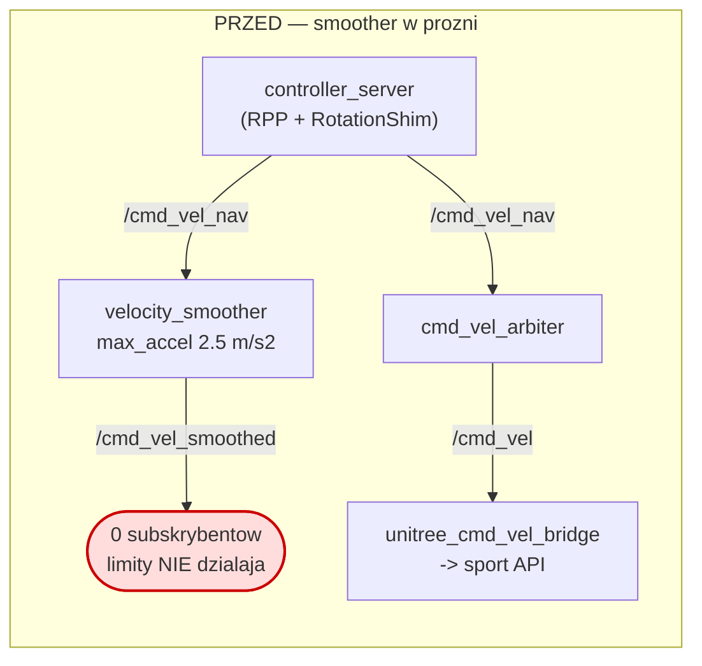
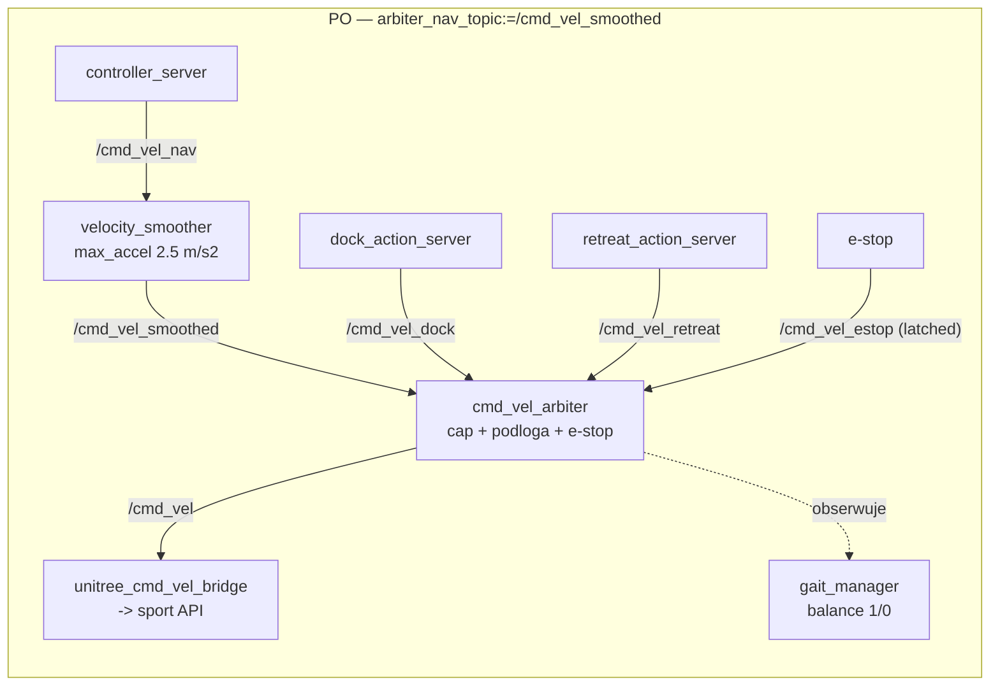
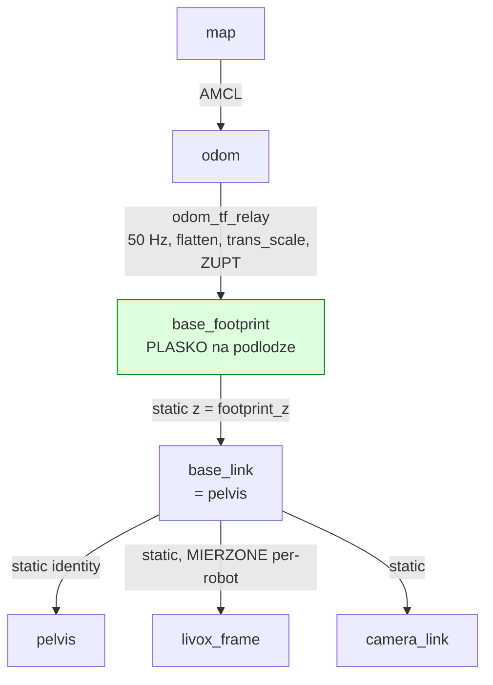
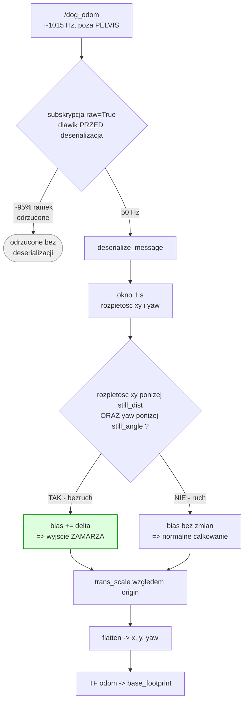
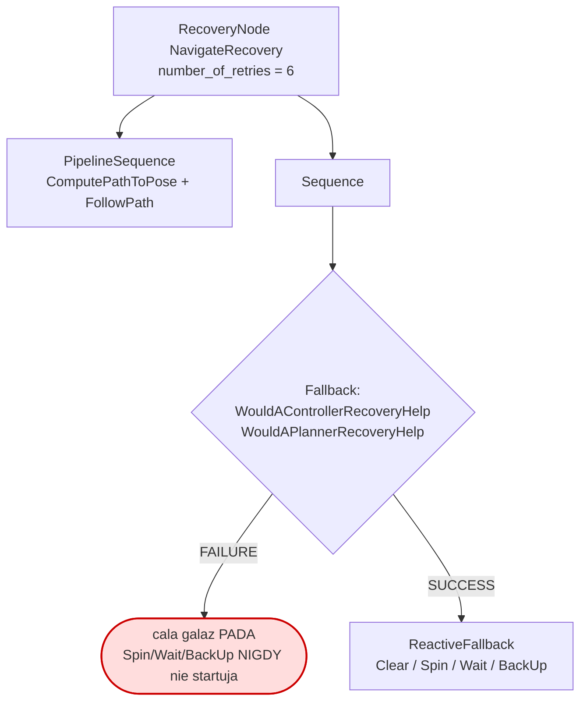
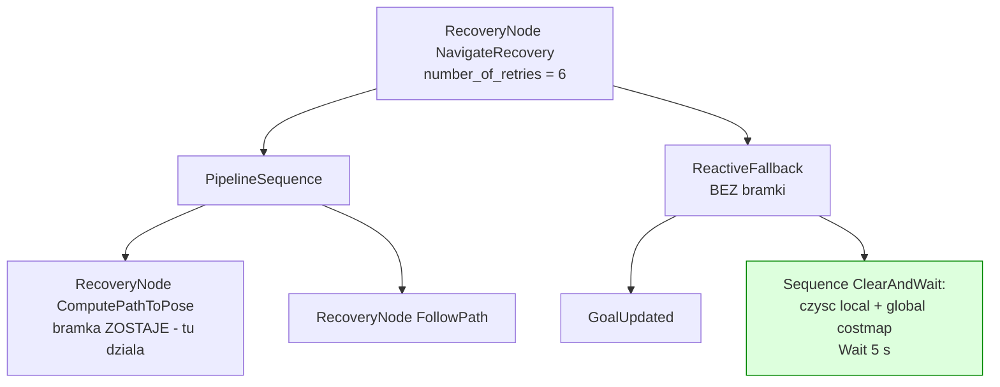

# Etap A — utwardzenie nawigacji: raport z pomiarów

**Data:** 2026-07-27 · **Platforma:** G1 29-DoF, Jetson Orin (8 rdzeni), ROS 2 Jazzy
w kontenerze · **Branch:** `courier-deploy`

Cel etapu: nav ma być *nudno przewidywalna*, bo jest fundamentem misji. Ten dokument
zapisuje **co zmierzono, czym i z jakim wynikiem** — łącznie z tym, czego nie
zmierzono. Liczby pochodzą z realnego robota, nie z symulacji.

> **Zasada tego raportu:** każde twierdzenie ma przy sobie pomiar albo jest oznaczone
> jako niesprawdzone. Wnioski „powinno działać" są w §6 (ryzyka), nie w §4 (wyniki).

---

## 1. Status testów

| # | Test | Status | Dowód |
|---|------|--------|-------|
| A1 | Dokładność dojazdu (5× ten sam cel, rozrzut < 15 cm) | ✅ zdany | powtarzalność 6.6 cm, najdalsza para 12.3 cm |
| A2 | Przeszkoda dynamiczna | ✅ zdany | replan ~1 Hz, objazd, brak kontaktu |
| A3 | Cel nieosiągalny | ✅ zdany | `Goal failed` w 8.9 s, bez błądzenia |
| A3b | Blokada **przejściowa** (dodany po odkryciu w A3) | ✅ zdany **po naprawie** | `Goal succeeded` po 3 rundach recovery |
| A4a | Odzysk lokalizacji — jazda pilotem | ⏭️ pominięty (decyzja operatora) | — |
| A4b | Odzysk lokalizacji — celowo błędna poza | ✅ zdany | AMCL dociągnął 0.43 m w locie |
| A5 | Pomiar CPU podczas jazdy | ✅ wykonany | 40% / 44% wysycenia |
| A6 | Test prędkości carry-mode | ✅ zdany mechanicznie | cap wymuszony, cel osiągnięty |

Wynik A1 wyznacza tolerancje dla Etapu B — patrz §4.7.

---

## 2. Trzy poprawki, które z tego wyszły

| # | Problem (zmierzony) | Poprawka | Default w repo |
|---|---|---|---|
| P1 | Odometria firmware **pełza na postoju**, AMCL wleczony, pozycja ucieka | ZUPT w `odom_tf_relay` | **OFF** (`still_dist: 0.0`) |
| P2 | Stockowe drzewo nav2 **pomija całe recovery** przy blokadzie przejściowej | `courier_navigate_to_pose.xml` | **OFF** (`nav_bt_xml` = stock) |
| P3 | `velocity_smoother` publikuje w próżnię → komendy **schodkowe** | param `nav_topic` w arbitrze | **OFF** (`/cmd_vel_nav`) |

Efekt P3 okazał się szerszy, niż zakładano: poza ścięciem szarpnięcia (5.88 → 2.57 m/s²)
robot stał się **2.8× szybszy przy tym samym capie prędkości** — firmware lepiej trawi
rampę niż schodek (§4.5).

Wszystkie trzy są **domyślnie wyłączone**: repo zachowuje się jak przedtem, dopóki
launch nie dostanie argów. To celowe — zmiany były weryfikowane na jednym robocie.

---

## 3. Topologia runtime

### 3.1 Łańcuch `cmd_vel` — problem P3

Nav2 publikuje surowe wyjście kontrolera na `/cmd_vel` (u nas remapowane na
`/cmd_vel_nav`), a jego `velocity_smoother` czyta **to samo** i wypuszcza
`/cmd_vel_smoothed`. Jeśli arbiter czyta `/cmd_vel_nav`, smoother wisi w powietrzu:





Arbiter zachowuje priorytety (dock > retreat > nav) i **e-stop nadrzędny nad wszystkim**.
Smoother wchodzi **przed** arbitrem, więc capy carry-mode nakładają się na już
wygładzony sygnał — kolejność jest istotna: odwrotna dawałaby wygładzanie, a potem
schodek od capa.

### 3.2 Drzewo TF (REP-120)



**Dlaczego `base_footprint`, a nie `base_link`:** firmware podaje w odometrii pozę
**miednicy** (z ≈ 0.75 m, wraz z przechyłami tułowia). Gdyby baza 2D nav2 leżała na
miednicy, AMCL kleiłby płaszczyznę mapy do bioder i przechył tułowia przesuwałby skan.
`odom_tf_relay` rzutuje pozę na podłogę (`flatten`: zeruje z, roll, pitch — zostaje
x, y, yaw), a `base_footprint → base_link` to statyczny spaw o wysokość miednicy.

Konsekwencja dla toru skanu: `pointcloud_to_laserscan` cięcie robi w `base_footprint`,
więc `min_height`/`max_height` to **wprost metry nad podłogą** (0.33–2.03 m) —
przenośne między robotami. Montaż lidaru zostaje per-robot w argach launcha.

### 3.3 Tor odometrii i ZUPT — problem P1



Trzy decyzje projektowe, każda z powodu:

1. **Detektor patrzy na rozpiętość OKNA, nie na prędkość chwilową.** Bias siedzi
   *wewnątrz* kołysania kostek: ±1 cm sway daje chwilowo ~0.05 m/s, więc próg
   prędkości przepuściłby pełzanie razem z kołysaniem. Rozpiętość okna 1 s rozdziela
   je czysto (stanie 1.1 cm vs chód 0.12 m/s → 12 cm).
2. **W warunku jest też yaw.** Bez tego obrót w miejscu (`RotationShim` na starcie
   każdej ścieżki) zostałby uznany za postój i **zamrożony** — nav przestałby widzieć
   obrót.
3. **Kompensacja biasem pochłaniającym delty, nie „skip publish".** Wyjście zamarza
   *bez skoku* przy wznowieniu, a odrzucone pełzanie nie wraca jako zaległość.

### 3.4 Drzewo zachowań — problem P2

Stockowe `navigate_to_pose_w_replanning_and_recovery.xml` owija gałąź recovery
w `Sequence` z warunkiem `WouldA*RecoveryHelp`. **Gdy bramka zwróci FAILURE, `Sequence`
pada i całe recovery jest pomijane:**



Nasze `courier_navigate_to_pose.xml`:



Dwie różnice i uzasadnienie każdej:

- **Recovery = „czyść costmapę → `Wait` 5 s → ponów", 6 rund ≈ 30 s cierpliwości.
  Bez `Spin`, bez `BackUp`.** `BackUp 0.30 m` cofa bipeda **na oślep**, a Mid-360 ma
  martwą strefę z tyłu i pod sobą — cofanie przy przeszkodzie jest groźniejsze niż samo
  utknięcie. Dla kuriera, któremu w drzwiach stanął człowiek, właściwą reakcją jest
  poczekać, aż przejdzie.
- **Brak bramki na górnym recovery**, zostaje w wewnętrznym `ComputePathToPose` — bo
  tam demonstracyjnie działa (dała przeplan 0.4 s po pierwszej porażce, §4.2).

**Świadomy koszt:** cel trwale niemożliwy nie pada już w 31 ms, tylko po ~30 s pętli.
Robot przez ten czas **stoi**, więc jest to bezpieczne — płacimy czasem za cierpliwość
tam, gdzie jest potrzebna. Użyto **wyłącznie węzłów występujących w drzewie stockowym**,
więc domyślna lista pluginów `bt_navigatora` je pokrywa (inaczej drzewo wywaliłoby się
dopiero przy pierwszym celu — błąd trudny do wykrycia w testach na sucho).

---

## 4. Wyniki pomiarów

### 4.1 Pełzanie odometrii na postoju (P1)

Robot stojący, FSM 501 (Regular), `balance 0`. Okno 60 s, `tools/standstill_diag.py`:

| tor | dryf netto / 60 s | „ścieżka" widziana przez nav | sway p-p |
|---|---|---|---|
| `/dog_odom` (surowa, firmware) | **+15.6 cm** | 111 cm | 1.1 cm |
| TF `odom→base_footprint` (×1.89) | **+29.3 cm** | 184 cm | 2.1 cm |
| `/amcl_pose` (mapa) | **+21.0 cm** | — | — |
| **TF po włączeniu ZUPT** | **+0.0 cm** | **0.0 cm** | 0.0 cm |

Rozpoznanie: **kołysanie jest niewinne.** Amplituda 1.1 cm i oscylacyjna (znosi się).
Winowajcą jest **monotoniczny bias DC ~2.6 mm/s do przodu** — miednica stoi
z pochyłem +1.5…+2.6°, a kinematyka nóg liczy z tego ciągły „krok". `trans_scale=1.89`
(kalibracja dla jazdy) mnożył bias razem z sygnałem.

Po włączeniu ZUPT `/amcl_pose` przestaje się aktualizować na postoju — bo nie ma już
fikcyjnego ruchu, który go budził. To jest pożądane.

**Pełzanie jest zmienne, nie stałe.** Zmierzone od 0.23 do 2.6 mm/s, a kierunek się
zmienia: podczas jednego przebiegu pochłonięty bias *malał* (31.7 → 29.3 → 27.1 cm),
czyli odometria dryfowała raz w przód, raz w tył, zależnie od postawy. **Dlatego
odejmowanie stałego offsetu byłoby błędem** — przy założeniu stałego biasu do przodu
wyszłoby z tego ~30 cm błędu w drugą stronę. Detektor musi reagować na *stan*.

**ZUPT w ruchu (nie gubi dystansu):** przy starcie celu przełącza się w 0.40–0.45 s,
a podczas 9 s jazdy pochłonął 0.3 cm, czyli **nie zjada prawdziwego ruchu**. Koszt to
~2% dystansu na opóźnieniu detekcji przy starcie (test syntetyczny: 120 → 117.6 cm).

**Koszt CPU:** `/dog_odom` ma ~1015 Hz, a publikujemy 50 Hz — deserializowaliśmy ~95%
ramek tylko po to, by je wyrzucić. Subskrypcja `raw=True` z dławikiem *przed*
deserializacją: **71.1 → 61.8%** jednego rdzenia. Mniej, niż zakładano (~15%): reszta
to narzut rclpy na sam **odbiór** 1000 msg/s (waitset, `rmw take`, executor), którego
w Pythonie nie da się obejść. Zbicie do kilku % wymagałoby przepisania węzła na C++.

### 4.2 Recovery nav2 (P2)

Zachowanie **stockowego** drzewa, zmierzone:

| scenariusz | wynik | recovery |
|---|---|---|
| cel poza mapą (`GOAL_OUTSIDE_MAP`) | `Goal failed` w **31 ms** | żadne |
| cel w ścianie / nieznanym polu | `Goal failed` w **8.9 s** | żadne |
| **droga zablokowana ~10 s** | `Goal failed` po **1.4 s** | żadne |

Pierwsze dwa są **poprawne**: czyszczenie costmapy nie wciągnie punktu na mapę.
Trzeci to realna dziura — robot stał do końca, choć droga była już wolna.

Ścieżka diagnostyczna, która to rozstrzygnęła (warto powtórzyć przy podobnych objawach):

1. `test_spin` — wywołanie `/spin` **bezpośrednio**, z pominięciem drzewa →
   `spin completed successfully`. **Behaviory są sprawne**, więc wina w drzewie.
2. `tools/bt_trace.py` — subskrypcja `/behavior_tree_log` (nav2 publikuje tam **każde**
   przejście statusu węzła) + cel poza mapą, więc **robot się nie rusza**. Pokazał
   `WouldAPlannerRecoveryHelp: IDLE → FAILURE`, a za nim padającą gałąź.
3. Przeczytanie **całego** XML drzewa. Wcześniejszy filtrowany `grep` nie pokazał
   bramek — to był błąd metody, który kosztował dwie błędne hipotezy.

Po wpięciu drzewa kurierskiego, ten sam cel poza mapą: **7 prób plannera co 5.04 s**
(1 + 6 ponowień), potem `Goal failed` po ~30 s. Robot nie ruszył się ani razu.

**A3b — blokada przejściowa, weryfikacja końcowa:**

```
t=0.00   Begin navigating (0.53, 1.42) -> (-2.12, 2.01)
t=+1.1..+6.2   Passing new path x6            jedzie normalnie
t=+6.4 / +7.1  follow_path aborted x2         blokada
t=+9.9   ZUPT BEZRUCH                          stoi spokojnie
t=+12.6 / +18.1  kolejne rundy recovery (co ~5.5 s = Wait + narzut)
t=+18.8  Passing new path                      ZNALAZL DROGE, rusza
t=+37.0  Goal succeeded
```

Istotny szczegół: padał **`follow_path`, nie planner**. Planner cały czas znajdował
trasę — to *kontroler* nie mógł jej wykonać. Usunięta bramka blokowała właśnie ten
przypadek. Z 6 dostępnych rund cierpliwości zużyto 3.

### 4.3 Odzysk lokalizacji (A4b)

Pozę ustawiono celowo błędnie (~1 m w bok), cel 1.3 m:

```
t=0.00   Begin navigating (-1.56, 1.74) -> (-0.26, 1.84)
t=+2.06  planner failed z pozycji (-1.78, 2.11)   <- poza SKOCZYLA o 0.43 m
t=+2.17  Passing new path                          <- przeplan po 0.11 s
t=+13.88 Goal succeeded
```

AMCL dociągnął się skanem w locie. Korekta pozy wywróciła planner i kontroler
**przejściowo** — czyli dokładnie ten przypadek, który stockowe drzewo zamieniłoby
w `Goal failed`. Drzewo kurierskie poradziło się w 0.11 s, w scenariuszu, dla którego
nie było projektowane.

### 4.4 CPU na Jetsonie (A5)

`tools/cpu_probe.py` (sonda z `/proc` — Jetson nie ma `pidstat`/`htop`), 8 rdzeni:

| stan | suma CPU | wysycenie |
|---|---|---|
| postój, nav bezczynny | ~325% | **40%** |
| jazda do celu | ~353% | **44%** |

**Nawigacja kosztuje tylko +25 pp.** Obciążenie jest zdominowane przez koszty
**postoju**, nie jazdy.

| proces | CPU | uwaga |
|---|---|---|
| `nav2_container` | 92 → 98% | jeden proces, wielowątkowy |
| `odom_tf_relay` | 62% | **pułap: 62% jednego rdzenia** |
| `foxglove_bridge` | 17% | świadomy koszt wizualizacji |
| `pick`+`place`+`dock`+`retreat` | ~33% razem | **misja WYŁĄCZONA, a serwery chodzą** |
| `navigate_proxy` | +21% (tylko w trakcie celu) | — |

> **To koryguje założenie z `nav2_cpu_analysis_2026-06-25.md`, że Jetson jest
> wysycony.** Nie jest. Optymalizacje kosztem funkcjonalności (kamera, filtr chmury,
> obniżanie częstotliwości nav2) **nie mają uzasadnienia** przy 44% wysycenia.
> Najtańszy zapas na przyszłość: zbramkowanie serwerów akcji misji na `enable_mission`
> (~33 pp za jedną linię w launchu).

**Nie ma niskoczęstotliwościowego źródła odometrii.** `/lf/odommodestate`,
`/odommodestate` i `/lf/sportmodestate` mają publishera, ale **nie wysyłają nic**
(sprawdzone w `reliable` i `best_effort`) — to martwe topiki `unitree_go/SportModeState`
po Go2. Jedyne żywe źródło to `/dog_odom` @ 1015 Hz.

### 4.5 Carry mode (A6)

`/safety/set_carry_mode` ON → cel 2.15 m. Cap wymuszony **co do wartości**
z `safety.yaml`: `|vx|` max 0.300, `|vyaw|` max 0.400. `Goal succeeded` po 64.03 s,
ZUPT ani raz nie wrócił do `BEZRUCH` → robot szedł nieprzerwanie.

| przebieg | cap | dystans | czas | prędkość efektywna | tracking |
|---|---|---|---|---|---|
| normal, bez smoothera | 0.6 | 1.84 m | 6.57 s | 0.280 m/s | — |
| carry, **bez** smoothera | 0.3 | 2.15 m | 64.03 s | 0.034 m/s | 16% |
| carry, **ze** smootherem | 0.3 | 2.25 m | 23.53 s | **0.0955 m/s** | **39%** |

**Wygładzenie nie tylko ścięło szarpnięcie — zrobiło robota 2.8× szybszym przy
identycznym capie prędkości.** Mechanizm: generator chodu firmware znacznie lepiej
trawi **rampę** niż schodek; skok 0→0.3 w jednym ticku 20 Hz najprawdopodobniej
resetował cykl chodu. To jest to samo zjawisko, które w testach ręcznych wyglądało jak
„robot drga i myśli" przy zadanych 0.15–0.25 m/s.

Wniosek, który stąd płynie i który warto zapamiętać przy strojeniu: **przy tym firmware
kształt komendy ma większy wpływ na realną prędkość niż jej amplituda.** Zanim
podniesiesz `max_vx_carry`, upewnij się, że tor jest wygładzony — inaczej stroisz
objaw, nie przyczynę.

> ⚠️ **Zastrzeżenie metodyczne.** Para przebiegów carry (bez/ze smootherem) jest
> uczciwa: ten sam tryb, ten sam cap, niemal ten sam dystans (2.15 vs 2.25 m).
> **Nie kontrolowano kształtu trasy** (udział obrotów; `vyaw` też jest zaciśnięty 2×,
> a obrót w miejscu nie daje postępu), więc 2.8× to **silne wskazanie, nie liczba
> ostateczna**. Porównanie normal vs carry pozostaje niekontrolowane — normal
> zmierzono jeszcze **bez** smoothera, więc dziś nie wiadomo, ile daje w trybie normal.
>
> **Prędkości chwilowej NIE licz z `/dog_odom`.** Kołysanie ±1 cm w oknie 0.1 s
> generuje ~0.1 m/s fałszywej prędkości, a po przemnożeniu przez `trans_scale`
> estymator wypluł 0.803 m/s przy capie komend 0.300 — wartość fizycznie niemożliwą.
> Prędkość efektywna w tabeli liczona jest z **pozycji AMCL** (`Begin navigating` →
> `Goal succeeded`), i tylko tak ma sens.

**Przyspieszenie komend: max 5.88 m/s², mediana 0.00.** To sygnatura skoku
pełnozakresowego w jednym ticku 20 Hz (0.3 / 0.05 = 6.0), czyli komendy do robota są
**schodkowe** — a limit 2.5 m/s² skonfigurowany w `nav2_params.yaml` nie był stosowany
(problem P3). Dla paczki trzymanej w rękach **szarpnięcie jest groźniejsze niż zbyt
duża prędkość**, więc to była właściwa miara ryzyka, nie prędkość maksymalna.

**Po wpięciu smoothera (P3), ten sam skrypt i te same warunki:**

| metryka | bez smoothera | ze smootherem |
|---|---|---|
| przyspieszenie komend, max | **5.88 m/s²** | **2.57 m/s²** |
| cap `\|vx\|` / `\|vyaw\|` | 0.300 / 0.400 | 0.300 / 0.400 |

Skonfigurowany w `nav2_params.yaml` limit **2.5 m/s² zaczął obowiązywać** — szczytowe
szarpnięcie komend spadło 2.3×. Drobne przekroczenie (2.57 vs 2.5) to kwantyzacja:
smoother pracuje na 20 Hz, a jitter `dt` przy liczeniu ilorazu różnicowego zawyża wynik
o kilka procent.

### 4.6 Sprzężenie, które nas zaskoczyło: `trans_scale` to stała CHODU

Po wpięciu smoothera skan zaczął **wyraźnie uciekać od mapy przy jeździe do przodu**.
Sonda `tools/scale_verdict.py` (porównuje trzy tory jednocześnie pod ruchem):

| tor | dystans netto | dyaw |
|---|---|---|
| `/dog_odom` (surowa) | 2.146 m | −178.12° |
| TF po `trans_scale=1.885` | **4.044 m** | −178.33° |
| `/amcl_pose` (prawda) | 2.352 m | −178.32° |

**Skala wymagana = amcl/raw = 1.096**, a w configu było **1.890**. TF wmawiał
nawigacji 4.04 m przy realnych 2.35 m — **nadmiar +72%** — więc AMCL musiał kasować
**0.715 m błędu na każdy metr drogi**. To właśnie widać jako uciekający skan.

**Przyczyna:** `trans_scale` nie jest stałą robota — jest **stałą chodu**. Wartość 1.89
zmierzono, gdy komendy były schodkowe i robot się szurał (firmware mylił się o 47%).
Po wygładzeniu robot chodzi normalnie i firmware myli się już tylko o ~10%.
**Naprawa P3 unieważniła kalibrację odometrii** — sprzężenie, którego nie przewidziano.

> ⛔ **Wniosek operacyjny: po KAŻDEJ zmianie w torze `cmd_vel` (wygładzanie, capy,
> progi) przemierz `trans_scale`.** Włączenie `arbiter_nav_topic:=/cmd_vel_smoothed`
> bez rekalibracji rozwali lokalizację.

Rotacja jest przy tym mierzona bezbłędnie — wszystkie trzy tory zgodne w 0.2° przy
skali translacji mylącej się 1.7×. Stąd **objaw diagnostyczny**: jeśli AMCL rozjeżdża
się przy jeździe **do przodu**, a obrót naprowadza, wina jest w skali translacji,
nie w AMCL.

Po ustawieniu `trans_scale:=1.10` operator potwierdził **wzrokowo w Foxglove**, że skan
trzyma się ścian. **Nie jest to jeszcze potwierdzone liczbą** — przebieg weryfikacyjny
unieważniły dwa `Pose estimate` w środku okna pomiarowego (teleportują AMCL, a sonda
liczy na niego jako prawdę odniesienia; sonda wykrywa to teraz i przycina okno).

**Nierozwiązana anomalia:** w tym samym unieważnionym przebiegu surowa odometria
zgłosiła 1.6 cm netto w oknie zawierającym 2.5 m jazdy, choć w pomiarze wyżej
akumulowała poprawnie. Sonda dostała detekcję nieciągłości `/dog_odom` (skok > 5 cm
między próbkami przy ~1 kHz = reset odometrii firmware), żeby to złapać przy powtórce.

### 4.7 Rozrzut dojazdu (A1) — liczba wejściowa dla dokowania

5 podejść na **ten sam** cel, z pięciu różnych kierunków (+120°, −68°, −17°, −172°,
+90°), `tools/goal_spread.py`:

| miara | wynik |
|---|---|
| dokładność wzgl. zadanego punktu | śr. **5.9 cm**, max **9.4 cm** (limit `xy_goal_tolerance` 10 cm) |
| **powtarzalność** — max odchylka od środka chmury końców | **6.6 cm** (RMS 5.7 cm) |
| najdalsza para końców | **12.3 cm** |
| błąd yaw | ≤ 2.3° w czterech próbach, **11.5° w jednej** |

Powtarzalność (6.6 cm) jest **lepsza niż najgorsza dokładność** (9.4 cm) — robot
systematycznie ląduje nieco obok zadanego punktu, ale robi to konsekwentnie. Dla doku
to dobra wiadomość, bo dok podjeżdża **relatywnie** do wykrytej krawędzi, nie do
współrzędnych mapy.

> **Wejście do Etapu B:** dok musi tolerować **~12 cm rozrzutu pozycji** w pozie
> przeddokowej. Projektować z zapasem na **~20 cm**.

⚠️ **Yaw bywa na styku tolerancji przy podejściu wymagającym dużej rotacji finalnej.**
Jedyna próba z błędem 11.5° (przy `yaw_goal_tolerance` = 0.20 rad = 11.46°) to
podejście z +120°, czyli z dużym obrotem na końcu. Pozostałe cztery: ≤ 2.3°.
Jeśli dokowanie okaże się wrażliwe na kąt startowy, zacieśnić `yaw_goal_tolerance`
albo wymuszać podejście z korytarza zbliżonego do docelowego kursu.

---

## 5. Jak to uruchomić

Argi do `real.launch.py` (wszystkie domyślnie wyłączone):

```bash
ros2 launch g1_courier_bringup real.launch.py \
  odom_still_dist:=0.03 \              # ZUPT: prog rozpietosci xy [m] (0 = OFF)
  nav_bt_xml:=courier \                # drzewo kurierskie (default = stock nav2)
  arbiter_nav_topic:=/cmd_vel_smoothed # wpiecie velocity_smoothera
```

Dobór `odom_still_dist`: ~3× szum stania i ~4× mniej niż dystans najwolniejszego chodu
w oknie 1 s. Na tym robocie stanie daje 1.1 cm, chód 0.12 m/s → 12 cm, więc **0.03**
ma zapas w obie strony. Wartość jest **per-robot** — zmierz `tools/standstill_diag.py`.

> ⛔ **Kolejność ma znaczenie.** Jeśli włączasz `arbiter_nav_topic:=/cmd_vel_smoothed`,
> **najpierw** włącz smoother, **potem** przemierz `odom_trans_scale`
> (`tools/scale_verdict.py`). Odwrotna kolejność daje skalę skalibrowaną dla innego
> chodu i rozjechaną lokalizację — patrz §4.6. Na InsideBocie było 1.89 → **1.10**.

Weryfikacja, że poprawki faktycznie weszły (nie polegaj na tym, że launch wystartował):

```bash
ros2 param get /bt_navigator default_nav_to_pose_bt_xml   # ma wskazywac courier_*.xml
ros2 topic info /cmd_vel_smoothed                          # Subscription count MUSI byc >= 1
ros2 node info /odom_tf_relay | grep still                  # albo szukaj "ZUPT" w logu
```

---

## 6. Rejestr ryzyk i znanych ograniczeń

| # | Ryzyko / ograniczenie | Skutek | Status |
|---|---|---|---|
| R1 | **ZUPT nie widzi popchnięcia** stojącego robota | odometria nie zgłosi przesunięcia; AMCL nadrobi skanem dopiero po wznowieniu ruchu | świadoma wymiana; akceptowalne dla robota-serwa |
| R2 | **Podłoga prędkości (0.12 m/s) spłaszcza rampę zwalniania** smoothera: sygnał 0.3→0 zostaje podniesiony do 0.12 i dopiero potem skacze do 0 | zwolnienie łagodniejsze niż przedtem, ale nie w pełni gładkie | do rozważenia: stosować podłogę tylko przy „zamierzonym ruchu" |
| R3 | `allow_unknown: true` w plannerze | cel klikniętny w **nieznane pole** wysyła robota poza zmapowany obszar, żeby to sprawdzić | zamierzone (dziury po cieniach sensora); chronić przez cele z misji, nie z ręki |
| R4 | `movement_time_allowance: 30.0` w `progress_checker` | utknięcie wykrywane dopiero po 30 s; wartość z ery symulacji | do przestrojenia |
| R5 | `transform_tolerance: 2.0` w `pointcloud_to_laserscan` | maskuje problemy z TF/zegarem | obniżyć do 0.2 |
| R6 | Yaw na styku tolerancji przy podejściu z dużą rotacją finalną (11.5° przy limicie 11.46°) | dok wrażliwy na kąt startowy mógłby chybić | zmierzone (§4.7); obserwować w Etapie B |
| R7 | Logi ROS w kontenerze przepadają przy odcięciu zasilania | diagnostyka po incydencie niemożliwa (raz już nas to kosztowało dane z testu) | rozwiązane: `ROS_LOG_DIR` na zamontowany wolumen |
| R8 | Zegar Jetsona po reboocie może wyprzedzać synchronizację chrony | stack startuje „w połowie zepsuty" (martwy bridge, dziwne TF) | sprawdzać `timedatectl` **przed** diagnozowaniem stacku |

---

## 7. Otwarte zadania

**Etap A zamknięty — wszystkie testy A1–A6 wykonane.** Zostaje strojenie i porządki:

1. **Domknąć liczbą korektę `trans_scale=1.10`** (§4.6). Operator potwierdził wzrokowo,
   że skan trzyma się mapy, ale pomiar unieważniły `Pose estimate` w oknie. Sonda
   `tools/scale_verdict.py` wykrywa to teraz sama; powtórzyć jeden prosty przejazd.
   Przy okazji sprawdzić nierozwiązaną anomalię odometrii z §4.6.
2. **Kontrolowany pomiar normal vs carry** na *tym samym* celu, oba **ze** smootherem.
   Dziś normal jest zmierzony tylko w starym torze, więc różnica trybów jest nieznana.
   Dopiero to daje podstawę do strojenia `max_vx_carry` (w `safety.yaml` stoi przy nim
   `TODO_TUNE`) — i rób to **z paczką w rękach**, bo masa zmienia dynamikę chodu.
3. Przestrojenie R4 i R5.
4. Zbramkowanie serwerów akcji misji na `enable_mission` (§4.4) — tylko jeśli
   zabraknie zapasu CPU; dziś nie brakuje.

---

## 8. Narzędzia pomiarowe

Instrumenty, którymi zebrano liczby z §4 — dołączone, żeby wyniki dały się **powtórzyć,
a nie tylko przeczytać**:

| narzędzie | mierzy | ruch robota |
|---|---|---|
| `tools/standstill_diag.py [s]` | dryf `/dog_odom` vs TF vs `/amcl_pose` na postoju | nie |
| `tools/bt_trace.py [s] [x] [y]` | przejścia statusów w drzewie BT (`/behavior_tree_log`) + cel poza mapą | nie |
| `tools/cpu_probe.py [s]` | CPU per proces z `/proc` + rozbicie na wątki najcięższego | nie |
| `tools/scale_verdict.py [s]` | skala odometrii pod ruchem (`amcl/raw`) + dryf `map→odom` na metr | tak (cel) |
| `tools/goal_spread.py [n] [s]` | rozrzut dojazdu: dokładność i powtarzalność osobno | tak (n celów) |

Wszystkie trzy są read-only i **nie ruszają robota** (`bt_trace` wysyła cel, którego
planner nie umie zrealizować, więc nie powstaje żadna ścieżka).
